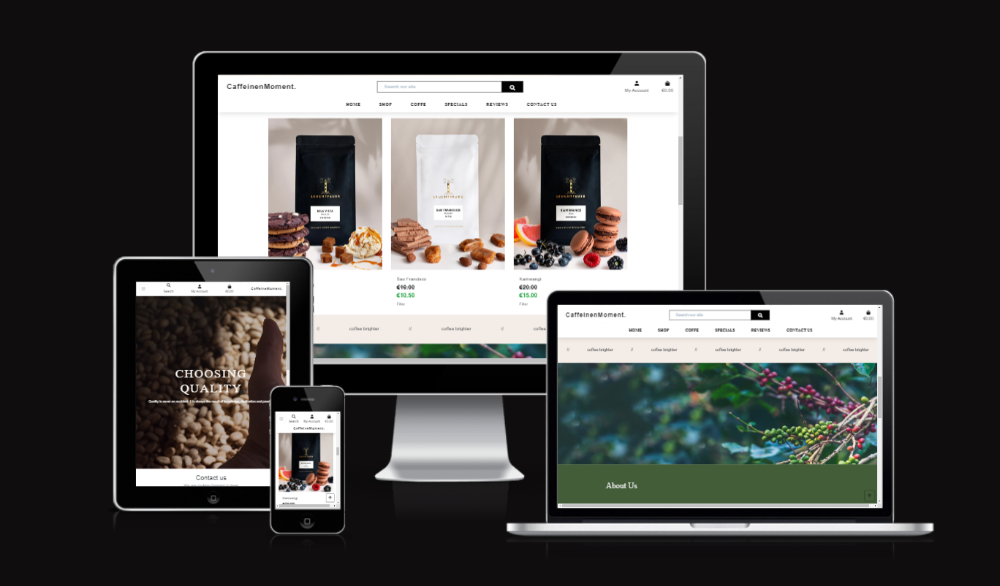
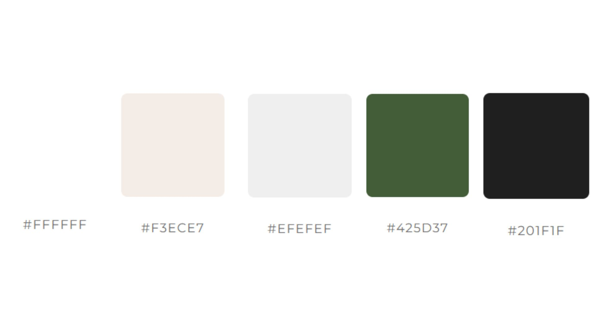

# CaffeineMoment - Introduction

Project milestone 5 for Code Institute Full-stack development program: Django Framework. 
CaffeineMoment is an E-commerce shop where users can buy coffes and search for
products by filtering different categories. They can also register by filling in their personal
information on the website’s profile page. All the visitors are welcome to drop a service review.
The application has a good appearance with an easy, clear and concise site navigation.

[Live Project Here!](https://caffeinemoment-3c13121aaa8c.herokuapp.com/)

### User Experience - UX

### User Stories

- As a website user, I can:

1. Navigate around the site and easily view the desired content.
2. View a list of products and choose accordingly.
3. Search products to find a specific product.
4. Click on a product to read and view the details.
5. Register for an account to avail of the services offered to members.
6. View product comments so that I can read other users opinions.
7. Buy a product by using the website checkout system.

- As a logged in website user, I can:

1. Review the website service.
2. Delete my previous reviews.
3. Save my data under my personal profile.
4. Edit my previous reviews.
5. Manage my profile by updating my details.
6. Logout of the website.
7. Using my personal profile, buy a product by using the website checkout system.

- As a website Superuser, I can:

1. Create and publish a new product.
2. Create a draft of a a new product so it can be finalised later.
3. Create a new user, products, and categories.
4. Delete user, products, categories and reviews.
5. Approve user's reviews.
6. Change a user’s permissions on the website
7. Upload new banners to be displayed on the website.

### Agile Methodology

All functionality and development of this project were managed using GitHub which Projects can be found
[here](https://github.com/soukasamadi/CaffeineMoment/issues)

### The Scope

#### Main Site Goals

- To provide users with a good website experience.
- To provide users with a visually pleasing website that is intuitive and easy to navigate.
- To provide a website with a clear purpose.
- To provide tools that allow users to search for products.
- To provide users with an easy and safe way to buy their products.

## Design

#### Colours

 

- The colour scheme is kept simple by opting for a combination of white text set against the image
background and black text set against the white background. The navbar was set on a white background
and a light grey on the bottom. The interactive colour is used for icons and the website logo.
Yellow is used for the "Buy Now" buttons and red is used to the "Discover More" buttons. The Dark grey was used for the
website footer. This contrasts with the rest of the website.

#### Typography

- The Montserrat font is used as the main font for the whole project. The Sofia Sans Condensed & Nanum Myeongjo font is used to display the website logo and some titles.

