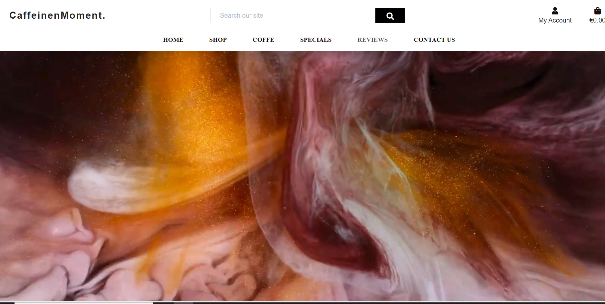

# CaffeineMoment - Introduction

Project milestone 5 for Code Institute Full-stack development program: Django Framework. 
CaffeineMoment is an E-commerce shop where users can buy coffes and search for
products by filtering different categories. They can also register by filling in their personal
information on the website’s profile page. All the visitors are welcome to drop a service review.
The application has a good appearance with an easy, clear and concise site navigation.

[Live Project Here!](https://caffeinemoment-3c13121aaa8c.herokuapp.com/)

### User Experience - UX

### User Stories

- As a website user, I can:

1. Navigate around the site and easily view the desired content.
2. View a list of products and choose accordingly.
3. Search products to find a specific product.
4. Click on a product to read and view the details.
5. Register for an account to avail of the services offered to members.
6. View product comments so that I can read other users opinions.
7. Buy a product by using the website checkout system.

- As a logged in website user, I can:

1. Review the website service.
2. Delete my previous reviews.
3. Save my data under my personal profile.
4. Edit my previous reviews.
5. Manage my profile by updating my details.
6. Logout of the website.
7. Using my personal profile, buy a product by using the website checkout system.

- As a website Superuser, I can:

1. Create and publish a new product.
2. Create a draft of a a new product so it can be finalised later.
3. Create a new user, products, and categories.
4. Delete user, products, categories and reviews.
5. Approve user's reviews.
6. Change a user’s permissions on the website
7. Upload new banners to be displayed on the website.

### Agile Methodology

All functionality and development of this project were managed using GitHub which Projects can be found
[here](https://github.com/soukasamadi/CaffeineMoment/issues)

### The Scope

#### Main Site Goals

- To provide users with a good website experience.
- To provide users with a visually pleasing website that is intuitive and easy to navigate.
- To provide a website with a clear purpose.
- To provide tools that allow users to search for products.
- To provide users with an easy and safe way to buy their products.

## Design

#### Colours

 

- The colour scheme is kept simple by opting for a combination of white text set against the image
background and black text set against the white background. The navbar was set on a white background
and a light grey shadow on the bottom. The interactive colour is used for icons hover.
green is used for some sections background.

#### Typography

- The Montserrat font is used as the main font for the whole project. The Sofia Sans Condensed & Nanum Myeongjo font is used to display the website logo and some titles.

#### Imagery

- Almost all the images were converted to webp format to improve the website performance. The product images and vertical banner are uploaded by the admin panel. 

#### Video

- On the home page, 2 videos playing under the navbar. One video is displayed on the desktop platform while
the second video plays on the mobile platform. The two videos were both compressed to improve the website's performance.

### Wireframes

Wireframes for this project are located [here](WIREFRAMES.md)

## Database Diagram

 

## Features

### Home Page

- The home page is equipped with a video on the top.
users will see a variety of products selected by the website admin. It can be used to highlight special
or popular products. The website admin can choose the displayed products by selecting a product in
the admin panel or from the website front-end by clicking on the featured box. 
User can get more information about the company reading the accordion on the about us section. 
They can subscribe to the newsletter using the form bellow. 
The footer section is qite simpe and clean to give the luxury feeling. 

- On this page, users will see all the products available on thewebsite such as product details. For example,
if the user is interested in the product they can press the image to see more details. They can also sort products by price, name, rating and category. Furthermore, when the site admin is logged in, it can edit or delete products. 

### Products Details

- This feature is at the top of the Product Details Page. Here users can see the product image and product
information such as price, category and rating. If the user is interested in it they can
choose the product  quantity and add the product to their cart. Also, the user can leave the
page by pressing the button "Keep Shopping". 

- Scrolling down, the user will have access to the full product details such as  features and  details. 
- In this feature users, can see a selection of products on sale. The sale items are chosen by the website admin by adding an old price and changing the product status to sale. This is completed through the admin panel or from the website front-end. 

### Products Shopping Bag

- This feature is called the Shopping bag. Here, users can add products and quantities. Check the total price, and delivery costs and go to the secure checkout to finish the order. Before secure checkout. the user can also change the quantity and remove unwanted products. The user can also leave this page by pressing the button "Keep Shopping". 

### Products Checkout

- On the checkout page, users will have to fill out the form and add the credit/debit card details to finish the purchase. 
- On the checkout page, users will have to fill out the form and add their credit/debit card details to finish the purchase. 

### Products Management

- When the website admin is logged in on this page, they can add a new product to the website without going to the admin panel. 

### Profile Page

- On this page a logged in user (with a valid registration account) can add or edit their own personal details and also check previous orders. 

#### Add/Edit Service Review Page

- On this page a user with a valid registration account and logged in can add or edit their own personal service reviews. 

### Logins Pages

- After submitting the Signup form, the user will be redirected to this page, advising them to check the link sent to their email box. 

- On the Login Page, users can log in to the website by inputting their username and password. The user is now
registered and will have access to the Registered User website services. 

- On the Logout Page, users can confirm that they wish to exit the website. 

### Page 404 - Page Not Found

- The user will see this feature when the page that the user is looking for, does not exist or for any typing URL error.   

<strong>To see more pages and feature visite the live website.</strong>
[Live Project Here!](https://caffeinemoment-3c13121aaa8c.herokuapp.com/)

