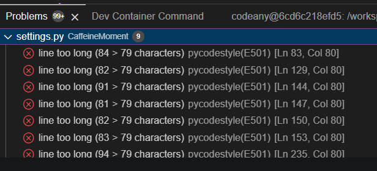
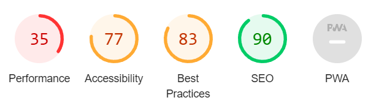
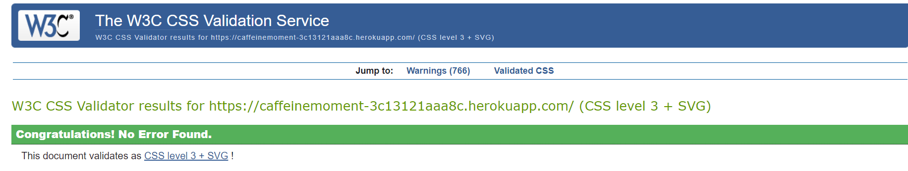
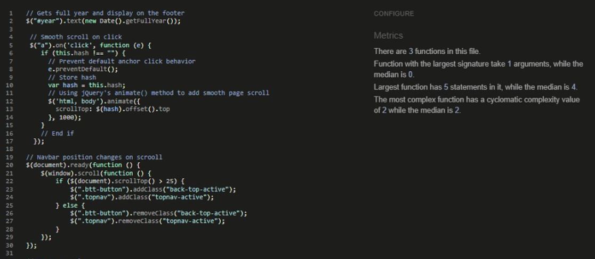
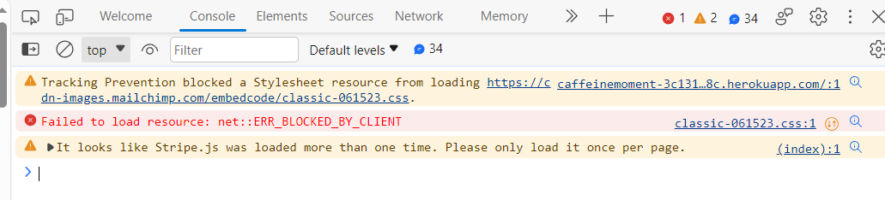

# Testing

Back to the [README](README.md)

* Testing has taken place continuously throughout the development of the project. Each view was tested regularly.
  When the outcome was not as expected, debugging took place at that point.  

### Python Validation - Pycodestyle

* Python testing was done using the Pycodestyle to ensure there were no syntax errors in the project. All python files were entered into the checker and no errors were found in any of the custom codes.
* execpt the too long lines.

.

#### Checked Python Files

#### App - Bag

* apps.py
* context.py
* urls.py
* views.py
  
#### App - Banners

* admin.py
* apps.py
* context_processors.py
* models.py
* urls.py
* views.py
*

#### App - Checkout

* admin.py
* apps.py
* forms.py
* models.py
* signals.py
* urls.py
* views.py
* webhook_handler.py
* webhooks.py
*

#### App - Home

* admin.py
* apps.py
* models.py
* urls.py
* views.py

#### App - Products

* admin.py
* apps.py
* context_processors.py
* forms.py
* models.py
* urls.py
* views.py
* widgets.py
  
#### App - Profiles

* admin.py
* apps.py
* forms.py
* models.py
* urls.py
* views.py
  
#### App - Reviews

* admin.py
* apps.py
* forms.py
* models.py
* urls.py
* views.py
* widgets.py

#### Project - CaffeineMoment

* asgi.py
* urls.py
* wsgi.py
* settings.py
* * manage.py

- A few errors were raised, however these were related to default django authorisation
code and could not be changed to remove the errors.

### Lighthouse

Lighthouse was used to test Performance, Best Practices, Accessibility and SEO on Desktop.

.

### CSS Validation

* Custom CSS was validated using W3C Jigsaw validation service. Some warnings were displayed, however,
  these are related to Google Fonts and some extension prefixes which will not affect the CSS performance.
  
.

### jQuery Validation

.

### Console Results

## Manual Testing

### Frontend

* The Signup, Login and Logout system has no issues and is working accordingly. It shows the right
  interactive message to the users.
* The Profile Page is working properly. It updates the user information. It shows the interactive message to the user once the update is complete.
* All the internal links are working and bring the user to the right page on the website.
* All the external links are working and bring the user to the right social media page by
  opening a new browser tab.
* The Categories Page shows the products filtered by category without issues.
* The drop-down menus in the navbar shows a list of categories on every page of the website.
* The service review form has no issues and it submits a new user review once the form is completed by a
  registered user.
* The functionality to delete a reviews, previously sent by the user or by the superuser, is
  working without issues. The Bootstrap model is opening to ask the user if they want to delete
  the review. Once the action is complete, the interactive message is displayed at the top right of the page.
* The functionality to add/update/delete a product, previously submitted by the website admin, is
  working without issues.
* The stripe payment system is working correctly and it is receiving the user's payment.
* Products can be filtered by different categories and this process is working correctly.

### Backend/Admin Panel

* I have tested the Admin Panel repeatedly since the start of the project development. All the models are working without issues.  
  I have created, deleted, and updated data in all models without errors. The models have the behaviour expected for what they were built for.
* Whenever a user submits a new review the Superuser has to approve it before it will be displayed on the website. This functionality is
  working without issues.

### Manual Test Case
The Test case for this project can be found [here](TEST_CASE.md)  

## Bugs

I spent considerable time trying to fix newsletter form not sending the data to the server without success. Then I had a call with my mentor and he figured out a script code was added to the footer by fault. and it causes the issue. 

